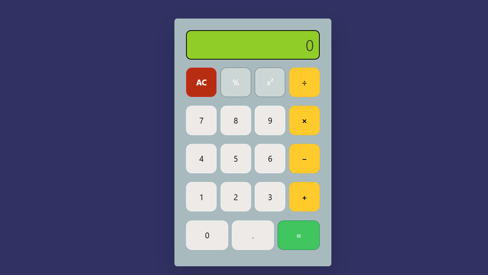

# 🧮 Calculator App

A simple and interactive calculator web application to perform basic arithmetic operations like **Addition, Subtraction, Multiplication, and Division**.  
Built with **HTML, CSS, and JavaScript** for a smooth and responsive user experience.  

---

## Features
-  Perform basic arithmetic operations  
-  Clean and responsive UI  
-  Fast and lightweight  
-  Works on desktop and mobile browsers  

---

## 🛠️ Tech Stack
- **Frontend**: HTML, CSS, JavaScript  
- **Version Control**: Git & GitHub  

---

## 📸 Screenshots

